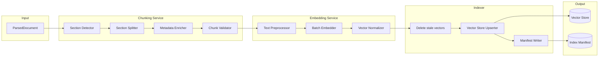
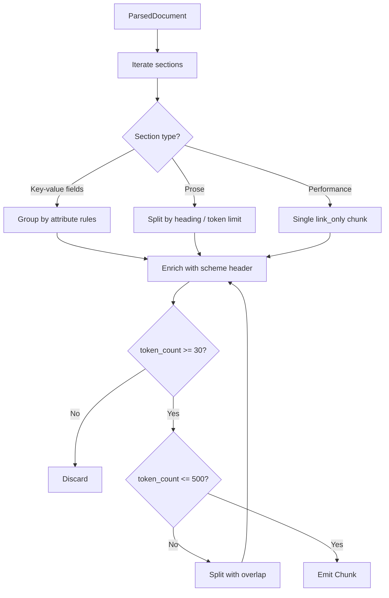
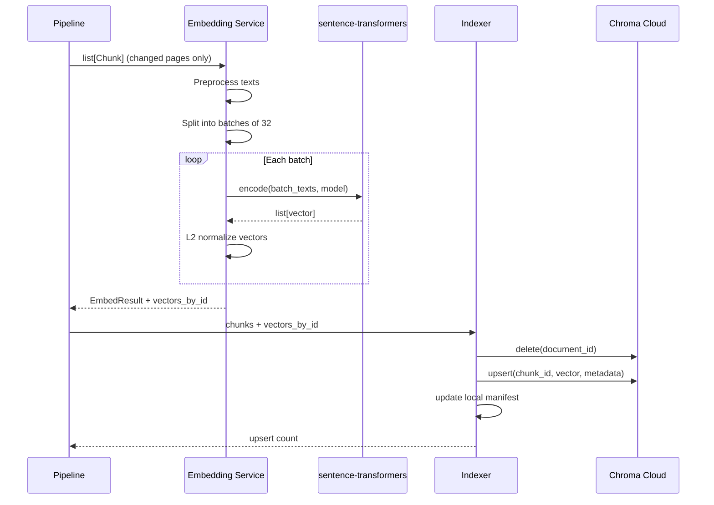
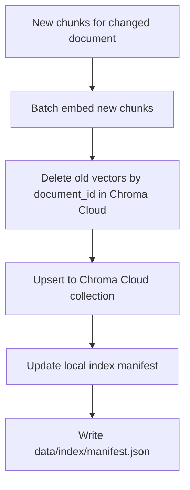
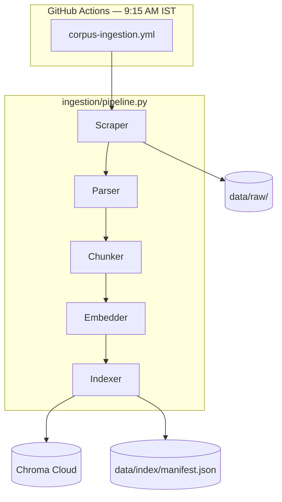

# Chunking, Embedding & Indexing Architecture

This document defines how parsed Groww scheme page content is **split into chunks**, **converted to vector embeddings**, and **persisted to the vector store** for the Mutual Fund FAQ RAG system. It complements [rag-architecture.md](./rag-architecture.md) (see §4.5–§4.8) and runs inside the daily **GitHub Actions** ingestion workflow.

---

## 1. Overview



| Service | Module | Responsibility |
|---------|--------|----------------|
| **Chunking Service** | `ingestion/chunker.py`, `ingestion/chunk_store.py` | Split parsed HTML sections into retrieval-ready chunks with metadata |
| **Embedding Service** | `ingestion/embedder.py` | Convert chunk text to dense vectors (does not write to vector store) |
| **Indexer** | `ingestion/vector_store.py`, `ingestion/embed_phase.py` | Upsert vectors to **Chroma Cloud**, delete stale vectors, update local manifest |

**When it runs:** After Scraping + Parser, only for pages where `content_hash` changed. Triggered daily at **9:15 AM IST** via GitHub Actions or manually via `python -m ingestion.pipeline`. Index refresh policy (schedule, failure handling) is defined in [rag-architecture.md §4.8](./rag-architecture.md#48-index-refresh-policy).

---

## 2. Chunking Architecture

### 2.1 Design Goals

| Goal | Rationale |
|------|-----------|
| **One fact per chunk (where possible)** | Improves precision for queries like "expense ratio" or "exit load" |
| **Preserve scheme context** | Every chunk must be attributable to one scheme and one source URL |
| **Section-aware splits** | Groww pages have distinct blocks (fees, benchmark, performance); split by section, not arbitrary token count |
| **Retrieval-friendly enrichment** | Prepend scheme name and section title so embeddings capture entity context |
| **Compliance tagging** | Tag performance sections so the generator can link-only, not compare returns |

### 2.2 Input Contract: `ParsedDocument`

The Parser outputs one `ParsedDocument` per successfully scraped Groww scheme page.

```python
@dataclass
class ParsedSection:
    section_id: str           # e.g. "fees_and_loads"
    title: str                # e.g. "Fees & Loads"
    content: str              # plain text or markdown
    fields: dict[str, str]    # e.g. {"expense_ratio": "1.08%", "exit_load": "1% if redeemed within 1 year"}

@dataclass
class ParsedDocument:
    document_id: str          # uuid; stable per scheme slug
    slug: str
    scheme_name: str
    scheme_category: str        # large-cap | mid-cap | elss | focused | equity
    source_url: str
    amc_name: str
    fetched_at: datetime
    content_hash: str
    sections: list[ParsedSection]
```

**Example Parser output (HDFC ELSS):**

```json
{
  "slug": "hdfc-elss-tax-saver-fund-direct-plan-growth",
  "scheme_name": "HDFC ELSS Tax Saver Fund – Direct Plan Growth",
  "scheme_category": "elss",
  "sections": [
    {
      "section_id": "fund_details",
      "title": "Fund Details",
      "fields": {
        "expense_ratio": "1.08%",
        "minimum_sip": "₹500",
        "lock_in_period": "3 years"
      }
    },
    {
      "section_id": "fees_and_loads",
      "title": "Fees & Loads",
      "fields": {
        "exit_load": "Nil",
        "stamp_duty": "As applicable"
      }
    }
  ]
}
```

### 2.3 Groww Page Section Map

The Chunking Service maps Groww DOM sections to canonical `section_id` values for consistent metadata across all 5 schemes.

| Groww section (typical) | `section_id` | Chunk strategy |
|-------------------------|--------------|----------------|
| Fund overview / about | `overview` | One chunk per subsection (objective, fund manager) |
| Fund details / key metrics | `fund_details` | One chunk per attribute group (see §2.4) |
| Fees, loads, minimums | `fees_and_loads` | Single chunk combining all fee fields |
| Benchmark & risk | `benchmark_and_risk` | Single chunk (benchmark index + riskometer) |
| Investment limits (SIP/lump sum) | `investment_limits` | Single chunk |
| Lock-in / tax (ELSS only) | `lock_in_and_tax` | Single chunk |
| Returns / performance / NAV | `performance` | Single chunk; tagged `answer_mode: link_only` |
| Holdings / sector allocation | `holdings` | One chunk (summary only) |

### 2.4 Chunking Rules

#### Rule 1: Attribute-group chunks (fund details, fees)

For sections with structured key-value fields, group related attributes into one chunk rather than one chunk per field (avoids over-fragmentation).

| Attribute group | Fields grouped together |
|-----------------|-------------------------|
| `fees_and_loads` | expense_ratio, exit_load, stamp_duty |
| `investment_limits` | minimum_sip, minimum_lumpsum, additional_purchase |
| `benchmark_and_risk` | benchmark, riskometer, risk_level |
| `lock_in_and_tax` | lock_in_period, tax_benefit (ELSS schemes only) |

**Example chunk text (before enrichment):**
```
Expense Ratio: 1.08%
Exit Load: Nil
Stamp Duty: As applicable
```

#### Rule 2: Prose sections (overview, holdings)

Split on heading boundaries. Target **200–400 tokens** per chunk. If a section exceeds 400 tokens, split at paragraph boundaries with **50-token overlap**.

#### Rule 3: Performance section

Always produce **exactly one chunk** tagged:
```json
{ "section_id": "performance", "answer_mode": "link_only" }
```
The chunk is indexed for retrieval (so the system knows performance was asked about) but the generator must respond with the Groww page link only — no return figures.

#### Rule 4: Minimum chunk size

Discard chunks under **30 tokens** after enrichment (likely parsing noise or empty sections).

#### Rule 5: Maximum chunk size

Hard cap at **500 tokens**. Split larger chunks at sentence boundaries with 50-token overlap.

### 2.5 Chunk Enrichment

Every chunk is prefixed with a structured header before embedding. This improves retrieval when users mention scheme names indirectly.

**Enrichment template:**
```
Scheme: {scheme_name}
Category: {scheme_category}
Section: {section_title}
Source: {source_url}

{chunk_body}
```

**Example enriched chunk:**
```
Scheme: HDFC ELSS Tax Saver Fund – Direct Plan Growth
Category: elss
Section: Fees & Loads
Source: https://groww.in/mutual-funds/hdfc-elss-tax-saver-fund-direct-plan-growth

Expense Ratio: 1.08%
Exit Load: Nil
Lock-in Period: 3 years
```

### 2.6 Output Contract: `Chunk`

```python
@dataclass
class Chunk:
    chunk_id: str              # uuid v5 from (document_id + section_id + chunk_index)
    document_id: str
    chunk_index: int           # 0-based within document
    text: str                  # enriched text (what gets embedded)
    token_count: int
    metadata: ChunkMetadata

@dataclass
class ChunkMetadata:
    source_url: str
    source_domain: str         # groww.in
    document_type: str         # scheme_page
    amc_name: str
    scheme_name: str
    scheme_category: str
    section_id: str
    section_title: str
    answer_mode: str           # factual | link_only
    last_fetched_at: str       # ISO date
    content_hash: str
    language: str              # en
```

### 2.7 Chunk ID Generation

Use deterministic IDs so re-indexing the same content replaces existing vectors instead of duplicating.

```
chunk_id = uuid5(NAMESPACE_URL, f"{document_id}:{section_id}:{chunk_index}")
```

On re-ingestion (when `content_hash` changes), the Indexer deletes all **vectors** for the matching `document_id` before upserting new ones. Chunk JSON in `data/chunks/` is overwritten by the Chunking Service separately.

### 2.8 Chunking Pipeline Flow



### 2.9 Expected Chunk Counts (v1)

| Scheme category | Estimated chunks per page |
|-----------------|---------------------------|
| Large-cap / mid-cap / equity / focused | 8–12 |
| ELSS (extra lock-in section) | 10–14 |
| **Total (5 schemes)** | **~45–60 chunks** |

### 2.10 Chunk Quality Validation

Before passing to the Embedding Service, validate each chunk:

| Check | Action on failure |
|-------|-------------------|
| `source_url` in allowlist | Reject chunk |
| `scheme_name` non-empty | Reject chunk |
| `text` non-empty after strip | Discard |
| No HTML tags remaining | Strip tags and re-validate |
| `content_hash` matches parent document | Reject (stale) |

---

## 3. Embedding Architecture

### 3.1 Design Goals

| Goal | Rationale |
|------|-----------|
| **Same model at ingest and query time** | Avoid train-serve skew in vector similarity |
| **Batch efficiency** | Embed all ~50–60 chunks in one GitHub Actions run with batched local inference |
| **Normalized vectors** | Cosine similarity = dot product; simplifies retrieval scoring |
| **Incremental indexing** | Only re-chunk, re-embed, and re-index pages whose `content_hash` changed |
| **Metadata co-located** | Store full chunk metadata alongside vectors for filtering and citation |

### 3.2 Model Selection

| Option | Dimensions | Pros | Cons |
|--------|------------|------|------|
| **`bge-small-en-v1.5`** (recommended) | 384 | Free; runs locally in GitHub Actions; strong retrieval baseline | Requires `sentence-transformers`; first run downloads model weights |
| **`text-embedding-3-small`** | 1536 | High quality; easy API; good for financial terms | Requires API key; cost per run |
| **`e5-small-v2`** | 384 | Strong baseline; free | Same as above |

**Recommendation for v1:** `BAAI/bge-small-en-v1.5` via `sentence-transformers` — no external API key, runs fully inside GitHub Actions, and corpus size (~60 chunks/day) keeps local inference fast.

**Config (`config/embedding.yaml`):**

```yaml
embedding:
  provider: sentence_transformers
  model: BAAI/bge-small-en-v1.5
  dimensions: 384
  batch_size: 32
  normalize: true
  query_prefix: "Represent this sentence for searching relevant passages: "
  max_retries: 3
  retry_delay_seconds: 2
```

### 3.3 Text Preprocessing (Before Embedding)

The Embedding Service receives enriched `Chunk.text` and applies final normalization:

| Step | Action |
|------|--------|
| 1. Whitespace | Collapse multiple spaces/newlines to single space |
| 2. Encoding | Ensure UTF-8; replace invalid chars |
| 3. Truncation | Trim to model max input (512 tokens for `bge-small-en-v1.5`) — unlikely at 500-token chunks |
| 4. Empty check | Skip chunks with empty post-process text |

**Important:** Embed the **enriched** text (with scheme/section header), not raw chunk body alone. The header carries entity context into the vector space.

### 3.4 Batch Embedding Flow



### 3.5 Embedding Service Interface

```python
# ingestion/embedder.py (conceptual)

@dataclass
class EmbedResult:
    embedded_count: int
    skipped_count: int
    failed_chunk_ids: list[str]
    model: str
    dimensions: int

class EmbeddingService:
    def __init__(self, config: EmbeddingConfig): ...

    def embed_chunks(self, chunks: list[Chunk]) -> tuple[EmbedResult, dict[str, list[float]]]:
        """Batch-embed all chunks; return vectors keyed by chunk_id (no vector store write)."""

    def embed_query(self, query: str) -> list[float]:
        """Single query embedding — same model/preprocessing as ingest."""

    def _normalize(self, vector: list[float]) -> list[float]:
        """L2 normalization for cosine similarity via dot product."""
```

### 3.6 Vector Normalization

After receiving raw embeddings, apply L2 normalization:

```
v_normalized = v / ||v||₂
```

At query time:
```
similarity = dot(query_vector, chunk_vector)   # equivalent to cosine similarity
```

This is applied to both ingested chunk vectors and live query vectors.

### 3.7 Indexer (Vector Store)

The **Indexer** persists embedded chunks to **[Chroma Cloud](https://www.trychroma.com/)** and writes operational metadata to a local manifest. Implemented in `ingestion/vector_store.py` and orchestrated by `ingestion/embed_phase.py` after the Embedding Service completes. See [rag-architecture.md §4.7](./rag-architecture.md#47-indexer-vector-store).

#### 3.7.0 Vector DB state (v1)

| State layer | Location | Contents |
|-------------|----------|----------|
| **Vectors + chunk text** | Chroma Cloud — collection `mutual_fund_faq_chunks` | Embeddings, metadata, enriched `document` field |
| **Index manifest** | `data/index/manifest.json` | Model version, dimensions, per-slug `content_hash`, chunk counts, timestamps |

Vectors are **not** stored under `data/index/chroma/` when using `chroma_cloud` (that path is used only for `chroma_local` dev/tests). GitHub Actions and the chat API both connect to the same remote Chroma Cloud database.

**Connection:** `chromadb.CloudClient()` with `CHROMA_API_KEY`, `CHROMA_TENANT`, `CHROMA_DATABASE` (see `config/vector_store.yaml` in rag-architecture §4.7).

**Latest-only retention:** Successful re-indexing replaces vectors for the scheme's
stable `document_id`. Schemes removed from the corpus manifest have their vectors
deleted. Locally, only each scheme's current chunk and facts payload is retained;
generated `history/` files are pruned after a completed scheduler run.

#### 3.7.1 Vector Store Schema

Each record in Chroma Cloud (same schema as open-source Chroma):

```json
{
  "id": "chunk_id (uuid)",
  "vector": [0.012, -0.034, ...],
  "metadata": {
    "document_id": "uuid",
    "source_url": "https://groww.in/mutual-funds/...",
    "scheme_name": "HDFC ELSS Tax Saver Fund – Direct Plan Growth",
    "scheme_category": "elss",
    "section_id": "fees_and_loads",
    "section_title": "Fees & Loads",
    "answer_mode": "factual",
    "last_fetched_at": "2026-07-17",
    "content_hash": "abc123...",
    "token_count": 87
  },
  "document": "Scheme: HDFC ELSS... Expense Ratio: 1.08%..."
}
```

| Field | Purpose |
|-------|---------|
| `id` | Unique chunk identifier; used for upsert and deletion |
| `vector` | Dense embedding for similarity search |
| `metadata` | Pre-filtering (scheme, section) and citation resolution |
| `document` | Raw enriched text returned to retriever / generator |

#### 3.7.2 Upsert Strategy

```python
# ingestion/vector_store.py + ingestion/embed_phase.py (conceptual)

class VectorStore:
    def __init__(self): ...  # chromadb.CloudClient from CHROMA_* env
    def delete_by_document_id(self, document_id: str) -> None: ...
    def upsert_chunks(self, chunks: list[Chunk], vectors_by_id: dict[str, list[float]]) -> int: ...
    def update_manifest(self, *, embedding_model: str, dimensions: int, documents: list) -> None: ...
```

**Flow:**



**`data/index/manifest.json`** tracks index state locally (vectors remain in Chroma Cloud):

```json
{
  "last_run_at": "2026-07-17T03:45:12Z",
  "embedding_model": "BAAI/bge-small-en-v1.5",
  "dimensions": 384,
  "documents": [
    {
      "slug": "hdfc-elss-tax-saver-fund-direct-plan-growth",
      "content_hash": "abc123",
      "chunk_count": 11,
      "last_indexed_at": "2026-07-17T03:46:01Z"
    }
  ],
  "total_chunks": 52
}
```

**Incremental logic:**

| Condition | Action |
|-----------|--------|
| `content_hash` unchanged | Skip chunking, embedding, and indexing for that scheme |
| `content_hash` changed | Re-chunk → re-embed → delete old vectors in Chroma Cloud by `document_id` → upsert |
| New scheme added to manifest | Full chunk + embed + index in Chroma Cloud |
| Scheme removed from manifest | Delete all vectors by `document_id` in Chroma Cloud |
| Chroma Cloud write failure | Abort indexing for affected slug; retain previous remote vectors |

### 3.8 Query-Time Embedding

The chat API uses the **same** `EmbeddingService.embed_query()` method at runtime:

```
User query: "What is the exit load for HDFC Mid Cap Fund?"
     ↓
Query guardrail (pass)
     ↓
embed_query(query) → query_vector
     ↓
Vector search: top-k=10, filter scheme_name if detected
     ↓
Hybrid merge with BM25 → rerank → generate
```

**Query preprocessing:** Same whitespace normalization as ingest. For BGE models, prepend the retrieval query prefix from config (`query_prefix`) at query time only — do **not** prepend scheme headers or the query prefix to chunk text at ingest.

### 3.9 Error Handling

| Failure | Behavior |
|---------|----------|
| Model load / encode failure | Retry with exponential backoff (3 attempts) |
| Single chunk embed failure | Log `chunk_id`; continue batch; report in `EmbedResult.failed_chunk_ids` |
| Entire batch failure | Abort embedding; retain previous index for affected document |
| Model dimension mismatch | Fail fast at startup — validate config vs model |
| Vector store write failure (Chroma Cloud) | Abort pipeline for affected slug; GitHub Actions job fails and alerts |

### 3.10 Cost & Performance Estimates (v1)

| Metric | Estimate |
|--------|----------|
| Chunks per full re-index | ~50–60 |
| Tokens per chunk (avg) | ~150 |
| Total tokens per run | ~9,000 |
| Embedding cost | $0 (local model) |
| Embedding latency (60 chunks, batch 32) | ~5–15 seconds (CPU in GitHub Actions) |
| GitHub Actions step budget | Well within 30-min timeout |

---

## 4. End-to-End Pipeline Integration



**Pipeline pseudocode:**

```python
def run_pipeline():
    scrape_results = scraper.scrape_all()
    parse_results = parser.parse_all(scrape_results)
    chunk_summary = run_chunk_phase(parse_results, scrape_results)

    # embed_phase orchestrates Embedding Service + Indexer
    embedded, embed_failed, embed_skipped, vectors_total = run_embed_phase(scrape_results)

    write_job_summary(...)
```

Inside `run_embed_phase()` for each changed slug:

```python
chunks = chunk_store.load_latest_payload(slug)["chunks"]
embed_result, vectors_by_id = embedder.embed_chunks(chunks)

vector_store.delete_by_document_id(document_id)   # Chroma Cloud
vector_store.upsert_chunks(chunks, vectors_by_id) # Chroma Cloud
vector_store.update_manifest(...)                  # local JSON
```

---

## 5. Testing Strategy

See [edge-case-evaluation-catalog.md](./edge-case-evaluation-catalog.md) for the
complete ingestion, chunking, embedding, indexing, fault-injection, and
cross-phase evaluation backlog.

| Test file | What it validates |
|-----------|-------------------|
| `tests/test_chunker.py` | Section splits, attribute grouping, enrichment format, min/max token rules |
| `tests/test_embedder.py` | Batch embedding, normalization, vector store upsert |
| `tests/test_embed_phase.py` | Embed + index orchestration for changed slugs |
| `tests/test_pipeline.py` | Scrape, parse, and chunk phase integration |

**Fixture-based chunking test example:**

```python
def test_elss_lock_in_chunk(chunker, elss_parsed_document):
    chunks = chunker.chunk(elss_parsed_document)
    lock_in_chunks = [c for c in chunks if c.metadata.section_id == "lock_in_and_tax"]
    assert len(lock_in_chunks) == 1
    assert "3 years" in lock_in_chunks[0].text
    assert "HDFC ELSS Tax Saver Fund" in lock_in_chunks[0].text
```

**Embedding test example:**

```python
def test_embed_query_same_dimension(embedder):
    vec = embedder.embed_query("expense ratio of HDFC Large Cap Fund")
    assert len(vec) == 384
    assert abs(sum(v*v for v in vec) - 1.0) < 0.01  # L2 normalized
```

---

## 6. Configuration Summary

| File | Purpose |
|------|---------|
| `config/corpus_manifest.yaml` | Scheme URLs and slugs |
| `config/embedding.yaml` | Model, batch size, normalization settings |
| `config/vector_store.yaml` | Chroma Cloud provider, collection name, host |
| `config/chunking.yaml` | Token limits, overlap, section map overrides |
| `data/index/manifest.json` | Local index metadata (vectors in Chroma Cloud) |

**`config/chunking.yaml`:**

```yaml
chunking:
  min_tokens: 30
  max_tokens: 500
  overlap_tokens: 50
  prose_target_tokens: 300
  enrichment_template: |
    Scheme: {scheme_name}
    Category: {scheme_category}
    Section: {section_title}
    Source: {source_url}

    {chunk_body}
```

---

## 7. Summary

| Stage | Input | Output | Key decision |
|-------|-------|--------|--------------|
| **Chunking** | `ParsedDocument` with sections + fields | ~50–60 enriched `Chunk` objects | Section-aware splits; attribute grouping; performance tagged `link_only` |
| **Embedding** | Enriched chunk text | 384-dim normalized vectors keyed by `chunk_id` | `BAAI/bge-small-en-v1.5`; same model at ingest and query; batch size 32 |
| **Indexing** | Chunks + vectors | Vectors in **Chroma Cloud** + local `data/index/manifest.json` | Delete-by-`document_id` then upsert; skip unchanged `content_hash` |

Together, the Chunking, Embedding, and Indexer services transform raw Groww HTML into a searchable, citation-ready vector index that powers factual retrieval in the FAQ assistant.
