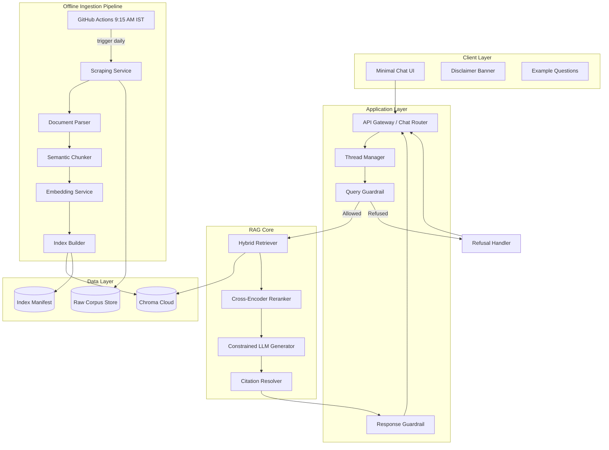
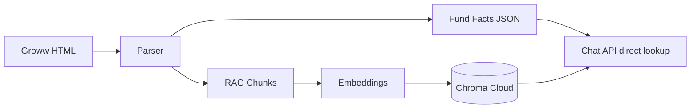
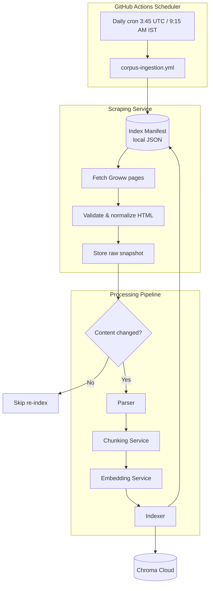
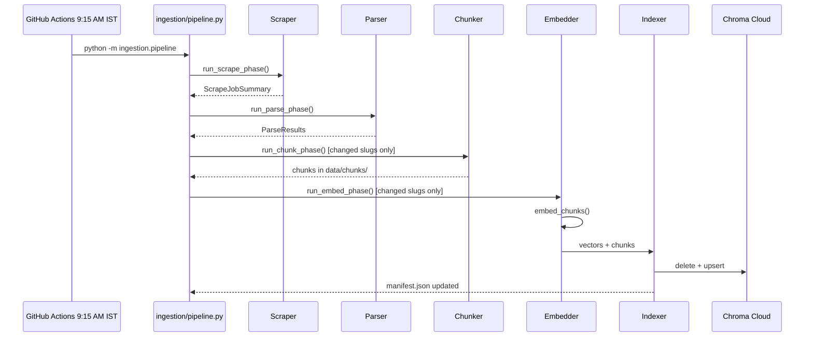
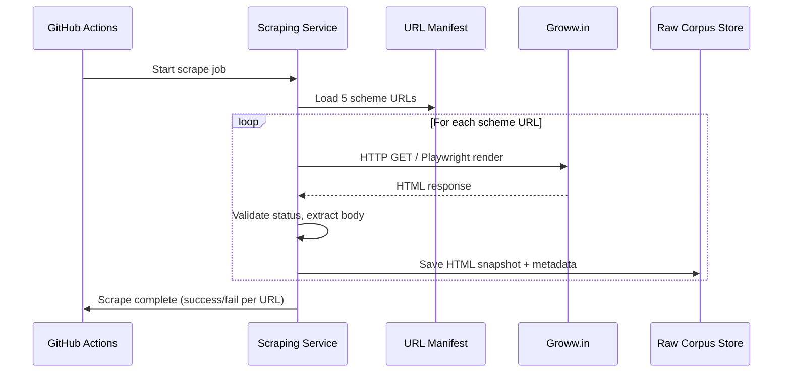
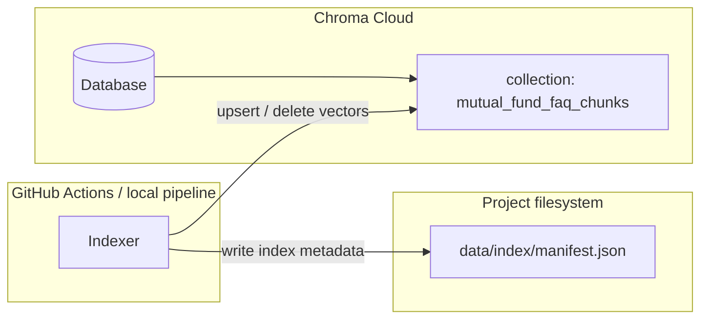
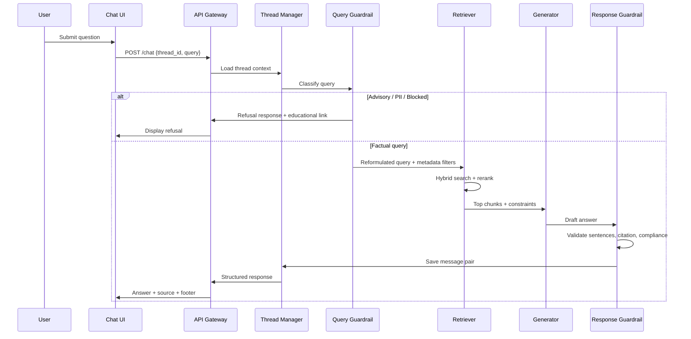
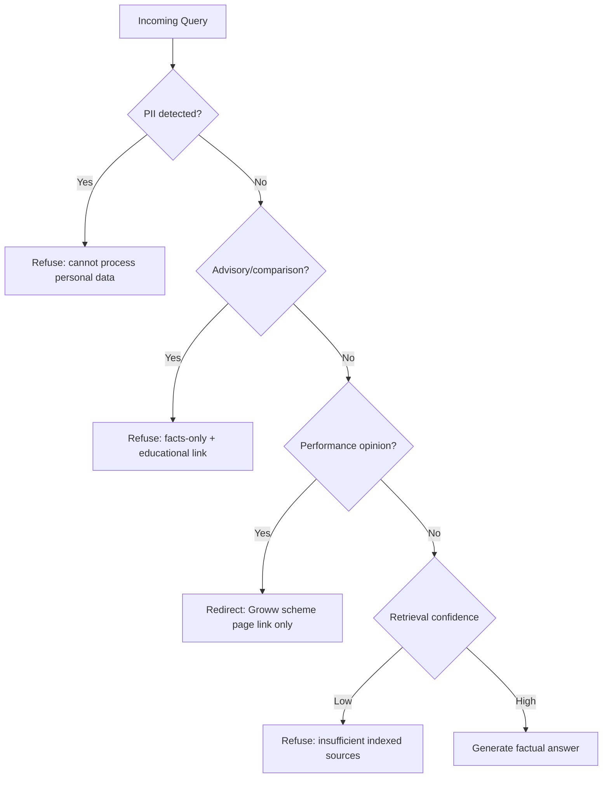
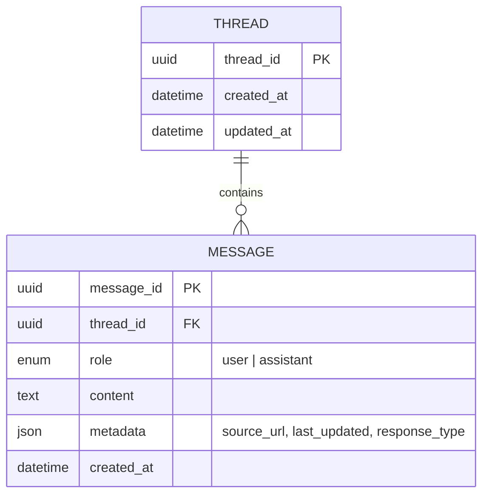

# RAG Architecture: Mutual Fund FAQ Assistant (Facts-Only Q&A)

This document defines the end-to-end architecture for a **Retrieval-Augmented Generation (RAG)** system that answers factual mutual fund queries. **v1 scope:** five **Groww** HDFC scheme pages (HTML only — no PDFs). It is derived from [ProblemStatement.md](./ProblemStatement.md) and serves as the implementation blueprint.

### Implementation roadmap (quick reference)

| Phase | Scope | Folder / modules | Status |
|-------|--------|------------------|--------|
| **1 — Ingestion** | Scheduler, scrape, parse, chunk, embed, index → Chroma Cloud | `.github/workflows/`, `ingestion/`, `config/` | **Implemented** |
| **2 — RAG core** | Hybrid retriever, generator, citation | `retrieval/`, `generation/`, `citation/`, `rag/` | **Implemented** |
| **3 — Guardrails** | Query classifier, response validator, refusal handler | `guardrails/` | **Implemented** |
| **4 — API & threads** | FastAPI chat router, thread manager | `app/` | **Implemented** |
| **5 — UI** | Responsive React chat UI, disclaimer, threads, examples | `ui/` | **Implemented** |
| **6 — Eval & hardening** | Labeled Q&A dataset, runtime tests, observability | `tests/`, `docs/` | Partial (ingestion tests only) |
| **7 — Multi-thread persistence** | SQLite thread store, session isolation (§7) | `app/services/thread_store.py` | **Implemented** |

**Offline path (Phase 1):** GitHub Actions at 9:15 AM IST → scrape → parse → chunk → embed → Chroma Cloud.

**Online path (Phases 2–5):** query → guardrails → retrieve → generate → validate → cite → UI. Phases 2–3 are implemented (`guardrails/` + RAG packages + CLI); Phases 4–5 add HTTP API and UI.

---

## 1. Architecture Goals

| Goal | Description |
|------|-------------|
| **Accuracy over intelligence** | Prefer verifiable retrieval over creative generation |
| **Source traceability** | Every factual answer cites exactly one indexed Groww scheme page URL |
| **Compliance by design** | Refuse advisory queries; block PII; no performance opinions |
| **Lightweight operation** | Minimal infra suitable for a curated corpus (5 Groww scheme pages) |
| **Fresh data daily** | GitHub Actions workflow + Scraping Service refresh corpus every day at 9:15 AM IST |
| **Multi-thread chat** | Independent conversation sessions without cross-contamination |

---

## 2. High-Level System Architecture



---

## 3. Component Breakdown

### 3.1 Client Layer (Minimal UI)

**Purpose:** Provide a simple, compliant chat experience aligned with Groww-style product context.

| Element | Specification |
|---------|---------------|
| Welcome message | Explains facts-only scope and the 5 indexed HDFC schemes on Groww |
| Example questions | 3 pre-filled prompts (e.g., expense ratio, ELSS lock-in, exit load) |
| Disclaimer | Fixed banner: **"Facts-only. No investment advice."** |
| Chat input | Single text field; no PII fields (no PAN, email, phone) |
| Response display | Answer text + single clickable source link + footer date |
| Thread selector | Optional sidebar or session list for multiple conversations |

**Design principle:** The UI never solicits sensitive data and never implies personalized advice.

---

### 3.2 Application Layer

#### 3.2.1 API Gateway / Chat Router

**Implementation (Phase 4):** `app/main.py`, `app/routers/chat.py`, `app/routers/threads.py` — see §4.11.

- Exposes REST or WebSocket endpoints: `POST /chat`, `GET /threads`, `POST /threads`, `GET /threads/{id}/messages`
- Validates request schema (query length, thread ID, no PII patterns)
- Routes to RAG pipeline or refusal handler
- Returns structured response:

```json
{
  "thread_id": "uuid",
  "answer": "string (max 3 sentences)",
  "source_url": "https://...",
  "source_title": "string",
  "last_updated": "YYYY-MM-DD",
  "response_type": "answer | refusal"
}
```

#### 3.2.2 Thread Manager

Supports **multiple independent chat threads** as required by the deliverables.

| Responsibility | Implementation |
|----------------|----------------|
| Session isolation | Each thread maintains its own message history |
| Context window | Pass only last *N* turns (e.g., 3) for follow-up resolution |
| No cross-thread leakage | Thread ID scoped retrieval and generation |
| Storage | SQLite (`data/threads.db`, default) or in-memory (`THREAD_STORE=memory`); Redis/PostgreSQL optional for prod scale |

**Implementation (Phase 4 + Phase 7):** `app/services/thread_manager.py`, `app/services/thread_store.py`, `app/services/context.py` — see §4.11 and §4.12.

**Note:** Thread history is used for query reformulation (e.g., "What about its exit load?" → resolve scheme entity from prior turn). It is **not** used to personalize investment advice.

#### 3.2.3 Query Guardrail (Pre-Retrieval)

Runs **before** retrieval to classify and filter queries.

**Allowed query types (factual):**
- Scheme attributes: expense ratio, exit load, minimum SIP, lock-in, riskometer, benchmark
- Process/how-to: statement download, capital gains report, KYC steps (from official guides)
- Regulatory definitions from AMFI/SEBI pages

**Blocked query types (refuse):**
- Investment advice: "Should I invest?", "Which fund is better?"
- Performance opinions: "Will this fund outperform?", return predictions
- Comparisons implying recommendation between schemes
- Queries containing PII patterns (PAN, Aadhaar, account numbers, OTP, email, phone)

**Classification approach (recommended stack):**
1. **Rule-based filters** — regex for PII; keyword blocklist for advisory phrases
2. **Lightweight classifier** — small LLM or embedding similarity against labeled refusal examples
3. **Fallback** — if uncertain and no confident retrieval, refuse with educational link

**Implementation (Phase 3):** `guardrails/query_classifier.py` — see §4.10.

**Implementation (Phase 4):** `app/routers/chat.py`, `app/services/thread_manager.py` — see §4.11.

#### 3.2.4 Response Guardrail (Post-Generation)

Validates LLM output before returning to user.

| Check | Action on failure |
|-------|-------------------|
| Sentence count ≤ 3 | Truncate or regenerate |
| Exactly one URL in citation | Re-resolve from retrieved chunk metadata |
| No advisory language | Block and return refusal template |
| No performance comparisons | Replace with Groww scheme page link only |
| Source URL in allowlist | Reject if URL not from indexed corpus |
| Footer date present | Inject from chunk `last_fetched_at` metadata |

**Implementation (Phase 3):** `guardrails/response_validator.py` — see §4.10.

---

### 3.3 RAG Core

#### 3.3.1 Retrieval Strategy

Given the small, curated corpus (5 Groww scheme pages), use a **hybrid retriever** for robustness across structured fund attributes (expense ratio, exit load, benchmark) and descriptive page sections.

```
Final Score = α × BM25_score + (1 − α) × cosine_similarity
```

| Stage | Detail |
|-------|--------|
| **Query understanding** | Optional: LLM-based query expansion with scheme name normalization |
| **Dense retrieval** | Top-k=10 from vector store (cosine similarity) |
| **Sparse retrieval** | BM25 over same chunk index (handles exact terms: "expense ratio", "exit load") |
| **Metadata filtering** | Filter by `scheme_name`, `document_type`, `amc` when detected in query |
| **Reranking** | Cross-encoder reranker on top-10 → select top-3 chunks |

**Recommended k values:** retrieve 10, rerank to 3, pass top 1–3 to generator.

**Implementation (Phase 2):**

| Package | Module | Role |
|---------|--------|------|
| `retrieval/` | `dense_retriever.py` | Chroma dense search + BGE query embed |
| `retrieval/` | `filters.py` | Metadata filters (`scheme_name`, category) |
| `retrieval/` | `bm25.py`, `reranker.py`, `hybrid_retriever.py` | BM25 + hybrid fusion + cross-encoder rerank |
| `generation/` | `generator.py` | Groq / OpenAI / `template` constrained LLM |
| `citation/` | `resolver.py` | One allowlisted Groww URL from top chunk |
| `rag/` | `pipeline.py` | `answer_guarded()` orchestration |
| `config/` | `rag.yaml` | Retrieval k-values, hybrid α, LLM provider |

**Query-time embedding:** reuses `ingestion/embedder.py` → `EmbeddingService.embed_query()` with BGE `query_prefix` from `config/embedding.yaml`.

**Query-time vector read:** reuses `ingestion/vector_store.py` → `VectorStore.search()` against the same Chroma Cloud collection as §4.7.

#### 3.3.2 Generation (Constrained LLM)

The LLM synthesizes a short answer **strictly from retrieved chunks** — not from parametric knowledge.

**System prompt (core constraints):**
- Answer only from provided context
- Maximum 3 sentences
- No investment advice, opinions, or recommendations
- No performance comparisons or return calculations
- If context insufficient, say so and do not invent facts
- Cite using the provided source URL metadata

**Context packaging:**
```
[CHUNK 1]
Source: {url}
Scheme: {scheme_name}
Document: {doc_type}
Last fetched: {date}
Content: {chunk_text}
---
[CHUNK 2]
...
```

**Temperature:** 0–0.2 (low creativity)

**Performance-related queries:** Generator returns a single sentence directing the user to the Groww scheme page — no return figures or comparisons.

#### 3.3.3 Citation Resolver

Ensures **exactly one citation link** per response.

1. Primary: use `source_url` from the highest-scoring reranked chunk
2. If generator mentions multiple URLs: override with chunk metadata URL
3. Validate URL exists in corpus allowlist
4. Attach `last_updated` from document fetch timestamp (not LLM-generated date)

**Implementation:** `citation/resolver.py` — validates URL against `config/corpus_manifest.yaml` allowlist via `ingestion/manifest.py`.

---

### 3.4 Data Layer

#### 3.4.1 Corpus Scope (Current Implementation)

| Dimension | Target |
|-----------|--------|
| AMC | **HDFC Mutual Fund** |
| Schemes | **5 schemes** with category diversity |
| URLs | **5 Groww scheme pages** (HTML only — no PDFs in current scope) |
| Format | Public web pages only; PDF ingestion (factsheets, KIM, SID) is **out of scope for v1** |

**Indexed schemes and source URLs:**

| Scheme | Category | Source URL |
|--------|----------|------------|
| HDFC Mid Cap Fund – Direct Growth | Mid-cap | https://groww.in/mutual-funds/hdfc-mid-cap-fund-direct-growth |
| HDFC Equity Fund – Direct Growth | Multi-cap / equity | https://groww.in/mutual-funds/hdfc-equity-fund-direct-growth |
| HDFC Focused Fund – Direct Growth | Focused | https://groww.in/mutual-funds/hdfc-focused-fund-direct-growth |
| HDFC ELSS Tax Saver Fund – Direct Plan Growth | ELSS | https://groww.in/mutual-funds/hdfc-elss-tax-saver-fund-direct-plan-growth |
| HDFC Large Cap Fund – Direct Growth | Large-cap | https://groww.in/mutual-funds/hdfc-large-cap-fund-direct-growth |

**Document types to index (v1 — HTML only):**

| Type | Typical content | Parsing notes |
|------|-----------------|---------------|
| Groww scheme page | Expense ratio, exit load, minimum SIP, benchmark, riskometer, fund overview | HTML; extract key-value pairs and section blocks |
| Groww scheme page (ELSS) | Lock-in period, tax benefit notes | Same HTML parser; tag `scheme_category: elss` |
| Groww scheme page (performance section) | Historical returns, NAV | Index for retrieval; **answers must link to page only** — no return comparisons in generated text |

**Out of scope (v1):**
- PDF factsheets, KIM, SID
- AMC FAQ/help pages, AMFI/SEBI standalone pages (may be added in a later phase for refusal educational links only)

**Source allowlist (hard constraint):**
- The 5 Groww URLs listed above (exact match or prefix allowlist on `groww.in/mutual-funds/hdfc-*`)

No other third-party blogs or aggregators beyond these indexed pages.

#### 3.4.2 Document Metadata Schema

Each chunk carries metadata for filtering, citation, and compliance:

```json
{
  "chunk_id": "uuid",
  "document_id": "uuid",
  "source_url": "https://...",
  "source_domain": "groww.in",
  "document_type": "scheme_page",
  "amc_name": "string",
  "scheme_name": "string",
  "scheme_category": "large-cap | flexi-cap | elss | ...",
  "section_title": "string",
  "page_number": 3,
  "last_fetched_at": "2026-07-17",
  "content_hash": "sha256",
  "language": "en"
}
```

#### 3.4.3 Vector Store

For a corpus of 5 HTML scheme pages (~50–200 chunks), a lightweight store is sufficient. **Ingestion-time persistence** is handled by the **Indexer** (§4.7); this section covers storage design for retrieval at query time.

| Option | Use case |
|--------|----------|
| **[Chroma Cloud](https://www.trychroma.com/)** | **v1 default** — managed remote Chroma; shared by ingestion (GitHub Actions) and chat API at runtime |
| **Chroma (local persistent)** | Dev fallback / offline tests without cloud credentials |
| **Qdrant / pgvector** | Alternative if Chroma Cloud is unavailable |

**v1 state split:**

| Layer | Location | Contents |
|-------|----------|----------|
| **Vector DB** | Chroma Cloud database + collection | Embeddings, chunk text, filter metadata |
| **Index manifest** | `data/index/manifest.json` (repo / CI artifact) | Per-slug `content_hash`, chunk counts, model version — not vectors |

**Index fields:** embedding vector + full metadata for pre-filtering.

#### 3.4.4 Raw Corpus Store

- Store fetched HTML snapshots in `data/raw/` or object storage (no PDF storage in v1)
- Version by `content_hash`; re-index only when hash changes
- Enables audit trail and re-processing without re-fetching

#### 3.4.5 Fund Facts Store (Priority Metrics)

Five fields are **business-critical** and stored in a dedicated **structured JSON store** in addition to RAG chunks:

| Field | Key | Example |
|-------|-----|---------|
| NAV | `nav` | `₹1,025.43` |
| Expense Ratio | `expense_ratio` | `1.01%` |
| Minimum SIP | `minimum_sip` | `₹100` |
| Fund Size | `fund_size` | `₹30,842 Cr` |
| Rating | `rating` | `5` |

**Why two stores?**

| Store | Purpose |
|-------|---------|
| **Fund Facts Store** (`data/facts/`) | Exact, deterministic values for direct lookup — no LLM interpretation |
| **Vector Store** (Chroma Cloud) | Semantic search for natural-language questions and supporting context |



**On-disk layout:**

```
data/facts/
├── catalog.json                              # index of all schemes + field list
├── hdfc-large-cap-fund-direct-growth/
│   └── latest.json                           # current metrics
└── hdfc-elss-tax-saver-fund-direct-plan-growth/
    └── latest.json
```

**Retention policy:** Latest-only retention is enabled by default. After a completed
scheduler run, old raw snapshots, fact/chunk history files, old summaries and run
logs, and local directories for schemes removed from the manifest are deleted.
The current `latest.json` artifacts required for change detection and serving remain.
If a `latest.json` file is missing or malformed, cleanup skips that directory to avoid
destroying the last recoverable copy. Set `INGESTION_KEEP_LATEST_ONLY=false` only
when historical artifacts are required for debugging or audit.

**`latest.json` schema:**

```json
{
  "slug": "hdfc-large-cap-fund-direct-growth",
  "scheme_name": "HDFC Large Cap Fund – Direct Growth",
  "scheme_category": "large-cap",
  "source_url": "https://groww.in/mutual-funds/hdfc-large-cap-fund-direct-growth",
  "fetched_at": "2026-07-17T03:45:12+00:00",
  "content_hash": "sha256...",
  "facts": {
    "nav": "₹1,025.43",
    "expense_ratio": "1.01%",
    "minimum_sip": "₹100",
    "fund_size": "₹30,842 Cr",
    "rating": "5"
  }
}
```

**Write path (daily ingestion):**
```
Scrape → Parse HTML → extract 5 fields → FundFactsStore.save()
                      → build key-metrics chunk → embed → index (§4.7)
```

**Read path (chat query):**

| Query type | Source |
|------------|--------|
| "What is the expense ratio of HDFC Large Cap?" | **Fund Facts Store** first (exact match) |
| "Tell me about this fund's fees and size" | **Vector Store** (semantic retrieval) |
| "What is the NAV?" | **Fund Facts Store** — value + Groww page citation |

**Implementation:** `ingestion/facts_store.py` (`FundFactsStore`) — populated by the Parser in the next pipeline phase.

---

## 4. Offline Ingestion Pipeline

The ingestion pipeline keeps the RAG corpus fresh by **scraping Groww scheme pages daily** and re-indexing when content changes. It is orchestrated by **GitHub Actions** and consists of a **Scraping Service** (data acquisition), **Parser**, **Chunking Service**, **Embedding Service**, and **Indexer**. Detailed design for chunking, embedding, and indexing is in [chunking-embedding-architecture.md](./chunking-embedding-architecture.md). Index refresh policy (when to re-run) is **§4.8** below.



### 4.1 Scheduler (GitHub Actions)

The **Scheduler** is implemented as a **GitHub Actions workflow** that triggers the full ingestion pipeline automatically every day so the assistant always serves the latest fund data available on Groww.

| Setting | Value |
|---------|-------|
| **Platform** | GitHub Actions |
| **Workflow file** | `.github/workflows/corpus-ingestion.yml` |
| **Frequency** | Daily |
| **Run time** | **9:15 AM IST** (Asia/Kolkata) |
| **UTC cron equivalent** | `45 3 * * *` (3:45 AM UTC) |
| **Job name** | `groww_corpus_refresh` |
| **Scope** | All 5 scheme URLs from `corpus_manifest.yaml` |

**Why 9:15 AM IST:** Runs shortly after Indian market open (9:15 AM), aligning with typical NAV and scheme page updates on trading days.

**Why GitHub Actions:** No separate scheduler infra to manage; version-controlled workflow; built-in logs and failure notifications; supports manual `workflow_dispatch` for on-demand runs.

**Scheduler responsibilities:**
1. Trigger the full ingestion pipeline daily at **9:15 AM IST** (`cron: 45 3 * * *` UTC)
2. Prevent overlapping runs via GitHub Actions concurrency group
3. Install dependencies and run `python -m ingestion.pipeline` (single entrypoint for all phases)
4. Upload job artifacts (logs, scrape snapshots) on failure; upload index manifest on success
5. Push updated embeddings to **Chroma Cloud** via Indexer (§4.7); persist local index manifest only

**Scheduled pipeline order (every run):**

| Step | Phase | What happens |
|------|-------|--------------|
| 1 | **Scrape** | Fetch all 5 Groww URLs; compute `content_hash`; save HTML to `data/raw/` |
| 2 | **Parse** | Extract fund fields from scraped HTML; save to `data/parsed/` and `data/facts/` |
| 3 | **Chunk** | Section-aware chunking for pages whose `content_hash` changed; save to `data/chunks/` |
| 4 | **Embed + Index** | BGE embeddings → delete old vectors by `document_id` → upsert to **Chroma Cloud** |

Steps 3–4 run only for schemes where scraped content changed. Unchanged pages keep their existing Chroma Cloud vectors.



**Workflow definition (`.github/workflows/corpus-ingestion.yml`):**

```yaml
name: Daily Corpus Ingestion

on:
  schedule:
    # 9:15 AM IST = 3:45 AM UTC
    - cron: "45 3 * * *"
  workflow_dispatch:  # manual trigger from GitHub UI

concurrency:
  group: corpus-ingestion
  cancel-in-progress: false  # do not cancel an in-progress run

jobs:
  ingest:
    runs-on: ubuntu-latest
    timeout-minutes: 30

    steps:
      - name: Checkout repository
        uses: actions/checkout@v4

      - name: Set up Python
        uses: actions/setup-python@v5
        with:
          python-version: "3.11"
          cache: pip

      - name: Install dependencies
        run: pip install -r requirements.txt

      - name: Install Playwright browsers
        run: playwright install chromium

      - name: Cache Hugging Face model
        uses: actions/cache@v4
        with:
          path: ~/.cache/huggingface
          key: huggingface-bge-small-${{ hashFiles('requirements.txt') }}

      - name: Run ingestion pipeline
        env:
          CHROMA_API_KEY: ${{ secrets.CHROMA_API_KEY }}
          CHROMA_TENANT: ${{ secrets.CHROMA_TENANT }}
          CHROMA_DATABASE: ${{ secrets.CHROMA_DATABASE }}
          PYTHONPATH: ${{ github.workspace }}
        run: python -m ingestion.pipeline

      - name: Upload ingestion logs on failure
        if: failure()
        uses: actions/upload-artifact@v4
        with:
          name: ingestion-logs
          path: logs/ingestion/
          retention-days: 7

      - name: Upload index manifest on success
        if: success()
        uses: actions/upload-artifact@v4
        with:
          name: index-manifest
          path: data/index/manifest.json
          retention-days: 30
```

**GitHub Actions concurrency (overlap prevention):**

```yaml
concurrency:
  group: corpus-ingestion
  cancel-in-progress: false
```

If a run is still in progress when the next cron fires, GitHub queues the new run until the current one completes.

**Required GitHub secrets:**

| Secret | Purpose |
|--------|---------|
| `CHROMA_API_KEY` | Chroma Cloud API key ([trychroma.com](https://www.trychroma.com/)) |
| `CHROMA_TENANT` | Chroma Cloud tenant ID |
| `CHROMA_DATABASE` | Chroma Cloud database name for this project |

**Optional env (non-default region):**

| Variable | Purpose |
|----------|---------|
| `CHROMA_HOST` | Region endpoint (default `api.trychroma.com`; EU: `europe-west1.gcp.trychroma.com`) |

**Manual trigger:** Use **Actions → Daily Corpus Ingestion → Run workflow** (`workflow_dispatch`) for on-demand refresh outside the daily schedule.

**Local development:** Run the same entrypoint without GitHub Actions:

```bash
python -m ingestion.pipeline
```

---

### 4.2 Scraping Service

The **Scraping Service** is responsible for **fetching the latest HTML content** from each Groww scheme URL defined in the manifest. It runs as the first step of every scheduled (or manual) ingestion job.



**Scraping Service responsibilities:**

| Step | Action |
|------|--------|
| 1. Load URLs | Read all scheme URLs from `config/corpus_manifest.yaml` |
| 2. Fetch page | Request each Groww scheme page and obtain rendered HTML |
| 3. Validate | Confirm HTTP 200, non-empty body, expected scheme slug in URL |
| 4. Normalize | Strip scripts/styles noise; retain fund detail DOM sections |
| 5. Hash | Compute `content_hash` (SHA-256) for change detection |
| 6. Persist | Save snapshot to `data/raw/{slug}/{YYYY-MM-DD_HH-mm}.html` |
| 7. Report | Return per-URL status: `{ url, status, fetched_at, content_hash, error? }` |

**Fetch strategy (Groww pages):**

| Approach | When to use |
|----------|-------------|
| **HTTP client** (`httpx` / `requests`) | First attempt; sufficient if page is server-rendered |
| **Headless browser** (Playwright) | Fallback if key fund fields are missing from static HTML |
| **Retries** | 3 attempts with exponential backoff (2s, 4s, 8s) |
| **Timeout** | 30s per URL |
| **Rate limiting** | 1–2 second delay between URLs (polite scraping) |

**Scraper request headers:**
```
User-Agent: MutualFundFAQBot/1.0 (+https://your-project.example.com)
Accept: text/html
Accept-Language: en-IN, en
```

**Scraping Service interface:**

```python
# ingestion/scraper.py (conceptual)

class GrowwScrapingService:
    def scrape_all(self) -> list[ScrapeResult]:
        """Fetch latest HTML for all manifest URLs."""

    def scrape_url(self, url: str, slug: str) -> ScrapeResult:
        """Fetch a single Groww scheme page."""

@dataclass
class ScrapeResult:
    url: str
    slug: str
    status: Literal["success", "failed"]
    http_status: int | None
    fetched_at: datetime
    content_hash: str | None
    raw_path: str | None
    error: str | None
```

**Output:** Raw HTML snapshots passed to the Parser only when `content_hash` differs from the last indexed version (incremental re-index).

**Error handling:**

| Failure | Behavior |
|---------|----------|
| Single URL fails | Log error; continue with remaining URLs; keep previous index for failed scheme |
| All URLs fail | Abort pipeline; retain existing index; raise alert |
| Timeout | Retry up to 3 times; mark URL failed if still timing out |
| Blocked / 403 | Log; optionally switch to Playwright; alert if persistent |

---

### 4.3 URL Manifest

Maintain `config/corpus_manifest.yaml`:

```yaml
amc: "HDFC Mutual Fund"
source_platform: "groww.in"
format: html  # no PDFs in v1

schemes:
  - name: "HDFC Mid Cap Fund – Direct Growth"
    category: mid-cap
    slug: hdfc-mid-cap-fund-direct-growth
    url: "https://groww.in/mutual-funds/hdfc-mid-cap-fund-direct-growth"

  - name: "HDFC Equity Fund – Direct Growth"
    category: equity
    slug: hdfc-equity-fund-direct-growth
    url: "https://groww.in/mutual-funds/hdfc-equity-fund-direct-growth"

  - name: "HDFC Focused Fund – Direct Growth"
    category: focused
    slug: hdfc-focused-fund-direct-growth
    url: "https://groww.in/mutual-funds/hdfc-focused-fund-direct-growth"

  - name: "HDFC ELSS Tax Saver Fund – Direct Plan Growth"
    category: elss
    slug: hdfc-elss-tax-saver-fund-direct-plan-growth
    url: "https://groww.in/mutual-funds/hdfc-elss-tax-saver-fund-direct-plan-growth"

  - name: "HDFC Large Cap Fund – Direct Growth"
    category: large-cap
    slug: hdfc-large-cap-fund-direct-growth
    url: "https://groww.in/mutual-funds/hdfc-large-cap-fund-direct-growth"

# Educational links for refusal responses (not indexed for RAG retrieval)
refusal_links:
  - label: "AMFI investor education"
    url: "https://www.amfiindia.com/investor/knowledge-center"
  - label: "SEBI mutual fund investor corner"
    url: "https://investor.sebi.gov.in/mutual_funds.html"
```

### 4.4 Parser

| Format | Tool | Status |
|--------|------|--------|
| HTML (Groww scheme pages) | `beautifulsoup4`, `trafilatura`, or Playwright + DOM extraction | **v1 — primary** |
| PDF | `pdfplumber`, `pymupdf` | **Deferred — not in v1 scope** |

Extract from Groww scheme pages:
- Plain text and labeled fund attributes (expense ratio, exit load, min SIP, benchmark, riskometer)
- Key-value blocks from fund overview / fund details sections
- Headings hierarchy for section-aware chunking (see [chunking-embedding-architecture.md](./chunking-embedding-architecture.md))
- Strip navigation, ads, and unrelated page chrome before chunking

### 4.5 Chunking Service

Splits parsed Groww page content into retrieval-ready text segments with metadata. Runs inside the GitHub Actions ingestion job after the Parser and before the Embedding Service.

| Aspect | Summary |
|--------|---------|
| **Input** | Structured `ParsedDocument` per scheme (sections + key-value fields) |
| **Output** | List of `Chunk` objects with enriched text and metadata |
| **Strategy** | Section-aware splitting tuned for Groww fund detail pages |
| **Full design** | [chunking-embedding-architecture.md §2](./chunking-embedding-architecture.md#2-chunking-architecture) |

**Implementation (v1):**

| Module | Role |
|--------|------|
| `config/chunking.yaml` | Token limits, overlap, enrichment template |
| `ingestion/chunker.py` | `ChunkingService` — section-aware splitting + enrichment |
| `ingestion/chunk_store.py` | Persists chunks to `data/chunks/{slug}/latest.json` |
| `ingestion/chunk_phase.py` | Pipeline integration (chunk only when `content_hash` changed) |

### 4.6 Embedding Service

Converts each chunk into a dense vector. Uses the same model at ingestion and query time. Does **not** write to the vector store — that is the Indexer's job (§4.7).

| Aspect | Summary |
|--------|---------|
| **Input** | `Chunk.text` (enriched with scheme/section prefix) |
| **Output** | L2-normalized float vectors keyed by `chunk_id` |
| **Model** | `BAAI/bge-small-en-v1.5` (384-dim) via `sentence-transformers` |
| **Full design** | [chunking-embedding-architecture.md §3.1–3.6](./chunking-embedding-architecture.md#31-design-goals) |

**Implementation (v1):**

| Module | Role |
|--------|------|
| `config/embedding.yaml` | Provider, model, dimensions, batch size, normalization, query prefix |
| `ingestion/embedder.py` | `EmbeddingService` — preprocess, batch embed, L2 normalize, `embed_query()` |

**Providers:**

| Provider | Use case |
|----------|----------|
| `sentence_transformers` (default) | Production — `BAAI/bge-small-en-v1.5`, runs locally (no API key) |
| `local` | Dev/tests — deterministic hash vectors via `EMBEDDING_PROVIDER=local` |

**Query-time prefix:** BGE retrieval models use `query_prefix` from config at query time only (not on chunk text at ingest).

**Env overrides:** `EMBEDDING_PROVIDER`, `EMBEDDING_MODEL`, `EMBEDDING_DIMENSIONS`, `EMBEDDING_QUERY_PREFIX`

### 4.7 Indexer (Vector Store)

Persists embedded chunks to **Chroma Cloud** and maintains a local index manifest. Runs immediately after the Embedding Service inside `ingestion/embed_phase.py`.

| Aspect | Summary |
|--------|---------|
| **Input** | `Chunk` objects + embedding vectors from §4.6 |
| **Output** | Vectors upserted to Chroma Cloud; local manifest updated |
| **Vector DB** | [Chroma Cloud](https://www.trychroma.com/) — managed remote Chroma (`chromadb.CloudClient`) |
| **Full design** | [chunking-embedding-architecture.md §3.7](./chunking-embedding-architecture.md#37-indexer-vector-store) |

#### Vector DB state (v1)

Two layers of state — vectors live in the cloud; operational metadata stays in the repo/CI:



| State layer | Location | What it holds | Who reads it |
|-------------|----------|---------------|--------------|
| **Vector records** | Chroma Cloud collection `mutual_fund_faq_chunks` | `id`, 384-dim vector, metadata, document text | Indexer (write), Retriever / chat API (read) |
| **Index manifest** | `data/index/manifest.json` | `embedding_model`, `dimensions`, per-slug `content_hash`, `chunk_count`, `last_indexed_at` | Ingestion pipeline (write), ops / debugging (read) |

**Chroma Cloud connection (`config/vector_store.yaml`):**

```yaml
vector_store:
  provider: chroma_cloud          # chroma_cloud | chroma_local
  collection_name: mutual_fund_faq_chunks
  cloud_host: api.trychroma.com   # default AWS us-east-1
  cloud_port: 443
```

Credentials via environment (from [Chroma Cloud dashboard](https://www.trychroma.com/) → Connect):

| Variable | Required | Purpose |
|----------|----------|---------|
| `CHROMA_API_KEY` | Yes | API authentication |
| `CHROMA_TENANT` | Yes | Tenant ID |
| `CHROMA_DATABASE` | Yes | Database name |
| `CHROMA_HOST` | No | Override host for non-default region |

**Client (conceptual):**

```python
import chromadb

client = chromadb.CloudClient()  # reads CHROMA_* env vars
collection = client.get_or_create_collection("mutual_fund_faq_chunks")
```

**Implementation (v1):**

| Module | Role |
|--------|------|
| `config/vector_store.yaml` | Provider (`chroma_cloud` / `chroma_local`), collection name, cloud host |
| `ingestion/vector_store.py` | `VectorStore` — `CloudClient` or local `PersistentClient`, upsert/delete, manifest |
| `ingestion/embed_phase.py` | Orchestrates embed → delete old vectors → upsert → update manifest |
| `data/index/manifest.json` | Local index state (not vector payloads) |

**Stored record schema (per chunk in Chroma Cloud):**

| Field | Purpose |
|-------|---------|
| `id` | `chunk_id` — used for upsert and deletion |
| `vector` | 384-dim normalized embedding |
| `metadata` | `document_id`, `scheme_name`, `section_id`, `answer_mode`, `content_hash`, etc. — for pre-filtering and citation |
| `document` | Enriched chunk text returned to retriever / generator |

**Upsert flow (changed pages only):**

```
content_hash changed → embed chunks → delete old vectors by document_id (Chroma Cloud)
                     → upsert new vectors (Chroma Cloud) → update data/index/manifest.json
```

**Incremental logic:**

| Condition | Action |
|-----------|--------|
| `content_hash` unchanged | Skip chunking, embedding, and indexing for that scheme |
| `content_hash` changed | Re-chunk → re-embed → delete-by-`document_id` in Chroma Cloud → upsert |
| Embed or upsert failure | Retain previous Chroma Cloud vectors for affected scheme; log error |
| Chroma Cloud unavailable | Abort indexing phase; do not update manifest for failed slugs |

**Runtime retrieval:** The chat API (§5) connects to the **same** Chroma Cloud database and collection as ingestion — no vector sync step between pipeline and API.

See also **§3.4.3 Vector Store** for technology options.

### 4.8 Index Refresh Policy

| Trigger | Action |
|---------|--------|
| **Scheduled (daily 9:15 AM IST)** | GitHub Actions workflow triggers Scraping Service → fetch all 5 URLs → diff by `content_hash` → re-index changed pages |
| **Manual** | GitHub Actions `workflow_dispatch` or local CLI: `python -m ingestion.pipeline` |
| **Per-URL failure** | Keep last successful index for that scheme; retry on next scheduled run |
| **Stale flag** | If `last_fetched_at` > 2 days for any scheme, surface warning in UI footer |

**Daily job flow (9:15 AM IST):**
```
09:15:00  GitHub Actions workflow starts (cron 45 3 * * * UTC)
09:15:01  Phase 1 — Scrape all 5 Groww URLs
09:15:30  Phase 2 — Parse HTML + save fund facts
09:15:40  Phase 3 — Chunk changed pages only
09:15:50  Phase 4 — Embed changed chunks + upsert to Chroma Cloud
09:16:30  Job complete; write logs/ingestion/ingestion_summary_latest.json
```

### 4.9 RAG Core (Phase 2 — Query-Time)

Runs at **query time** (not in the daily ingestion job). Reads from the same Chroma Cloud collection written by §4.7.

Phase 2 code uses **top-level packages** (same layout pattern as `ingestion/`):

| Package | Deliverable |
|---------|-------------|
| `retrieval/` | Dense search, BM25, hybrid fusion, reranker |
| `generation/` | Constrained answer generator |
| `citation/` | Citation resolver |
| `rag/` | Pipeline orchestration + CLI |

| Aspect | Summary |
|--------|---------|
| **Input** | User question (natural language) |
| **Output** | ≤3-sentence answer + single Groww citation URL + `last_updated` footer metadata |
| **Retrieval** | Hybrid dense + BM25 → cross-encoder rerank → top 3 chunks |
| **Generation** | Constrained LLM (`groq` default, or `openai`) or deterministic `template` provider for tests |
| **Citation** | Exactly one URL from top reranked chunk metadata; allowlist enforced |

**Pipeline:**

```
User query
  → embed query (BGE + query_prefix)
  → dense search (Chroma, top-10, optional metadata filter)
  → BM25 search (same corpus, top-10)
  → hybrid fuse (α × BM25 + (1−α) × dense)
  → cross-encoder rerank (top-10 → top-3)
  → constrained generate (top chunks as context)
  → citation resolve (allowlisted source_url + last_fetched_at)
```

**Configuration:**

| File | Keys |
|------|------|
| `config/rag.yaml` | `retrieval.*`, `generation.*` |
| `config/embedding.yaml` | Shared with ingestion — same model at query time |
| `config/vector_store.yaml` | Shared with ingestion — same Chroma collection |
| `.env` | `GROQ_API_KEY` / `OPENAI_API_KEY`, `LLM_PROVIDER`, `RAG_*` overrides |

**Local usage:**

```bash
# Template generator (no LLM key):
set LLM_PROVIDER=template
python -m rag.cli "What is the expense ratio of HDFC ELSS Tax Saver Fund?"

# Groq generator (default):
set LLM_PROVIDER=groq
set GROQ_API_KEY=gsk_...
python -m rag.cli --json "What is the minimum SIP for HDFC Large Cap Fund?"
```

**Programmatic usage:**

```python
from rag import build_rag_pipeline

pipeline = build_rag_pipeline()
result = pipeline.answer("What is the exit load on HDFC Focused Fund?")
print(result.answer, result.citation.source_url)
```

**Tests:** `tests/test_retrieval.py`, `tests/test_generation.py`, `tests/test_citation.py`, `tests/test_rag_pipeline.py`

**Not in Phase 2 (later phases):** HTTP API and threads (Phase 4), React UI (Phase 5). Phase 3 guardrails are documented in §4.10.

### 4.10 Guardrails (Phase 3 — Query-Time)

Runs **before and after** the Phase 2 RAG core inside `rag/pipeline.py`.

| Package | Module | Role |
|---------|--------|------|
| `guardrails/` | `query_classifier.py` | PII regex, advisory/comparison/performance-opinion blocklists |
| `guardrails/` | `response_validator.py` | ≤3 sentences, no advisory language, citation allowlist |
| `guardrails/` | `refusal.py` | Refusal templates + AMFI/SEBI links from `corpus_manifest.yaml` |
| `config/` | `guardrails.yaml` | Phrase blocklists, max query length |
| `rag/` | `pipeline.py` | `answer_guarded()` — classify → RAG → validate |

**Flow:**

```
User query
  → QueryClassifier (block PII / advisory / comparisons / performance opinions)
  → [if blocked] RefusalHandler + educational link
  → HybridRetriever → Generator → CitationResolver
  → ResponseValidator (truncate or refuse)
  → GuardedResponse (answer | refusal)
```

**CLI:**

```bash
python -m rag.cli "Should I invest in ELSS or large cap?"   # refusal
python -m rag.cli --json "What is the expense ratio of HDFC ELSS?"
python -m rag.cli --no-guardrails "..."                      # Phase 2-only path
```

**Tests:** `tests/test_guardrails.py`, `tests/test_refusal.py`

### 4.11 API & Threads (Phase 4 — HTTP)

REST API wrapping Phase 2–3 for multi-turn chat.

| Module | Role |
|--------|------|
| `app/main.py` | FastAPI app + lifespan (pipeline + thread store) |
| `app/routers/chat.py` | `POST /chat` |
| `app/routers/threads.py` | `GET/POST /threads`, `GET /threads/{id}/messages` |
| `app/services/thread_manager.py` | Thread facade + `build_thread_manager()` |
| `app/services/thread_store.py` | SQLite (default) or in-memory persistence (Phase 7) |
| `app/services/context.py` | Follow-up query reformulation from thread history |
| `app/schemas.py` | Request/response models |
| `config/api.yaml` | `max_context_turns`, API title/version |

**`POST /chat` response** (matches §3.2.1):

```json
{
  "thread_id": "uuid",
  "answer": "...",
  "source_url": "https://groww.in/...",
  "source_title": "...",
  "last_updated": "YYYY-MM-DD",
  "response_type": "answer",
  "chunk_ids": ["..."]
}
```

Refusals set `response_type: "refusal"`, omit scheme citation fields, and include `educational_link`.

**Run locally:**

```bash
uvicorn app.main:app --reload --port 8000
```

**Tests:** `tests/test_api.py`, `tests/test_thread_context.py`

### 4.12 Multi-Thread Persistence (Phase 7 — §7)

| Module | Role |
|--------|------|
| `app/services/thread_models.py` | `StoredThread`, `StoredMessage` datatypes |
| `app/services/thread_store.py` | `InMemoryThreadStore`, `SqliteThreadStore` |
| `app/services/thread_manager.py` | Facade + `build_thread_manager()` |
| `config/api.yaml` | `thread_store`, `thread_db_path` |

| Setting | Default | Description |
|---------|---------|-------------|
| `THREAD_STORE` | `sqlite` | `sqlite` or `memory` |
| `THREAD_DB_PATH` | `data/threads.db` | SQLite file when using `sqlite` |

**Tests:** `tests/test_thread_store.py`

---

## 5. Query Processing Flow (Runtime)

> **Status:** Phases 2–5 are implemented, including the React UI.



### 5.1 Example: Factual Query

**User:** "What is the expense ratio of HDFC ELSS Tax Saver Fund?"

1. Query guardrail: PASS (factual, scheme entity detected)
2. Metadata filter: `scheme_name = "HDFC ELSS Tax Saver Fund – Direct Plan Growth"`, `document_type = scheme_page`
3. Retrieve + rerank → top chunk from Groww page contains expense ratio text
4. LLM generates (≤3 sentences) with citation: `https://groww.in/mutual-funds/hdfc-elss-tax-saver-fund-direct-plan-growth`
5. Response guardrail validates; footer: `Last updated from sources: 2026-07-10`

### 5.2 Example: Refusal

**User:** "Should I invest in the large-cap fund or the ELSS fund?"

1. Query guardrail: BLOCK (comparative investment advice)
2. Return polite refusal + link to AMFI investor education page
3. No retrieval or generation invoked

---

## 6. Refusal Handling Architecture



**Refusal response template:**

```
I can only answer factual questions about mutual fund schemes using official
public sources. I cannot provide investment advice or recommendations.

For investor education, please refer to: {amfi_or_sebi_url}
```

**Educational link pool (curated, static):**
- AMFI: investor awareness pages
- SEBI: mutual fund investor corner

---

## 7. Multi-Thread Conversation Model

> **Implementation (Phase 7):** Persistent SQLite store (`THREAD_STORE=sqlite`, default) with in-memory option for tests (`THREAD_STORE=memory`). Schema matches the ER diagram below; assistant messages store citation metadata and `chunk_ids` for auditability.



| Behavior | Rule |
|----------|------|
| New conversation | `POST /threads` → new UUID |
| Message scope | Retrieval uses global corpus; history only for query reformulation |
| Concurrent users | Stateless API instances; thread state in shared store |
| Isolation | Thread A history never injected into Thread B |

---

## 8. Technology Stack (Recommended)

| Layer | Options |
|-------|---------|
| **Frontend** | React + TypeScript + Vite (Vercel) |
| **Backend** | FastAPI (Python) |
| **LLM** | OpenAI GPT-4o-mini / Azure OpenAI / local Llama 3 (with strict prompts) |
| **Embeddings** | `BAAI/bge-small-en-v1.5` via `sentence-transformers` (384-dim) |
| **Vector DB** | [Chroma Cloud](https://www.trychroma.com/) — remote managed Chroma (`chromadb.CloudClient`) |
| **Sparse search** | `rank-bm25` or Elasticsearch (optional at this scale) |
| **Reranker** | `cross-encoder/ms-marco-MiniLM-L-6-v2` |
| **Scheduler** | GitHub Actions (`corpus-ingestion.yml`) — daily 9:15 AM IST (`45 3 * * *` UTC) |
| **Scraping** | `httpx` + Playwright (fallback for JS-rendered Groww pages) |
| **HTML parsing** | `beautifulsoup4`, `trafilatura` |
| **PDF parsing** | Deferred (not in v1 scope) |
| **Orchestration** | LangChain or LlamaIndex (optional); plain Python acceptable for clarity |
| **Thread store** | SQLite (dev), PostgreSQL or Redis (prod) |

## 9. Project Structure

Legend: **Implemented** | Planned

```
mutual-fund-faq-rag/
├── .github/
│   └── workflows/
│       └── corpus-ingestion.yml      # Phase 1 — daily 9:15 AM IST ingestion
├── docs/
│   ├── ProblemStatement.md
│   ├── rag-architecture.md         # this document
│   └── chunking-embedding-architecture.md
├── config/
│   ├── corpus_manifest.yaml          # Phase 1
│   ├── chunking.yaml                 # Phase 1
│   ├── embedding.yaml                # Phase 1 + Phase 2 (query embed)
│   ├── vector_store.yaml             # Phase 1 + Phase 2 (Chroma read/write)
│   └── rag.yaml                      # Phase 2 — retrieval + generation
├── data/
│   ├── raw/                          # HTML snapshots from Scraping Service
│   │   └── {scheme-slug}/
│   └── index/
│       └── manifest.json             # local index metadata (vectors in Chroma Cloud)
├── ingestion/                        # Phase 1 — all implemented
│   ├── scraper.py
│   ├── parser.py
│   ├── chunker.py                    # §4.5
│   ├── chunk_store.py
│   ├── chunk_phase.py
│   ├── embedder.py                   # §4.6 (+ embed_query for Phase 2)
│   ├── vector_store.py               # §4.7 (+ search/list for Phase 2)
│   ├── embed_phase.py
│   └── pipeline.py
├── retrieval/                        # Phase 2 — hybrid search
│   ├── dense_retriever.py
│   ├── filters.py
│   ├── bm25.py
│   ├── reranker.py
│   └── hybrid_retriever.py
├── generation/                       # Phase 2 — constrained LLM
│   └── generator.py
├── citation/                         # Phase 2 — source URL resolution
│   └── resolver.py
├── guardrails/                       # Phase 3 — implemented
│   ├── query_classifier.py
│   ├── response_validator.py
│   └── refusal.py
├── rag/                              # Phase 2–3 — orchestration + CLI
│   ├── pipeline.py
│   └── cli.py
├── app/                              # Phase 4 — implemented
│   ├── main.py
│   ├── schemas.py
│   ├── routers/
│   │   ├── chat.py
│   │   └── threads.py
│   └── services/
│       ├── thread_manager.py
│       ├── thread_store.py           # Phase 7
│       ├── thread_models.py
│       └── context.py
├── ui/                               # Phase 5 — implemented
│   ├── src/                          # React UI + typed API client
│   ├── package.json
│   └── .env.example
├── tests/
│   ├── test_retrieval.py             # Phase 2
│   ├── test_generation.py            # Phase 2
│   ├── test_citation.py              # Phase 2
│   ├── test_rag_pipeline.py          # Phase 2–3
│   ├── test_api.py                   # Phase 4
│   ├── test_thread_context.py        # Phase 4
│   ├── test_thread_store.py          # Phase 7
│   ├── test_guardrails.py            # Phase 3
│   ├── test_refusal.py               # Phase 3
│   ├── test_scraper.py               # Phase 1
│   ├── test_chunker.py               # Phase 1
│   └── test_embedder.py              # Phase 1
├── requirements.txt
└── README.md
```

---

## 10. Security, Privacy, and Compliance

| Requirement | Architectural control |
|-------------|----------------------|
| No PAN/Aadhaar/account/OTP/email/phone | Input regex guardrail; no PII fields in UI; no logging of raw PII |
| Indexed sources only | Allowlist of 5 Groww HDFC URLs enforced at ingestion and citation resolution |
| No investment advice | Dual guardrails (query + response); constrained prompts |
| No performance comparisons | Response validator; performance queries → Groww scheme page link only |
| Transparency | Mandatory source URL + `last_updated` footer on every answer |
| Auditability | Store retrieval chunk IDs with each assistant message |

---

## 11. Observability and Evaluation

### 11.1 Logging

**Chat requests (per request):**
- `thread_id`, query hash (not raw if sensitive), guardrail decision
- Retrieved chunk IDs and scores
- Final source URL, response type, latency breakdown

**Ingestion jobs (GitHub Actions, daily 9:15 AM IST):**
- Workflow run ID, start/end time, duration
- Per-URL scrape status (`success` / `failed`), HTTP status, `content_hash`
- Changed vs skipped pages (hash diff result)
- Re-index chunk count and any parser/scraper errors

### 11.2 Evaluation Dataset

Build 30–50 labeled Q&A pairs from the corpus:

The full cross-phase failure and boundary-condition backlog is maintained in
[edge-case-evaluation-catalog.md](./edge-case-evaluation-catalog.md).

| Category | Example |
|----------|---------|
| Factual scheme attribute | "What is the exit load for Scheme X?" |
| Process/how-to | "How do I download my capital gains statement?" |
| Regulatory | "What is ELSS lock-in period per AMFI?" |
| Refusal (advisory) | "Which fund should I choose?" |
| Refusal (performance) | "What returns will Scheme X give next year?" |

**Metrics:**

| Metric | Target |
|--------|--------|
| Retrieval recall@3 | ≥ 90% on eval set |
| Citation accuracy | 100% (URL matches ground-truth source) |
| Refusal precision | ≥ 95% (no advisory answers slip through) |
| Sentence limit compliance | 100% |
| Response latency (P95) | < 5s |

---

## 12. Known Limitations

1. **Corpus coverage** — Answers are limited to the 5 indexed Groww HDFC scheme pages; questions about other AMCs or schemes cannot be answered.
2. **HTML-only v1** — No PDF factsheets, KIM, or SID; deep legal/regulatory detail available only on those documents is not in the corpus.
3. **Groww as source surface** — Content is sourced from Groww scheme pages (product context), not directly from HDFC AMC or AMFI/SEBI document repositories.
4. **Page staleness** — Groww pages update on their schedule; a failed daily scrape retains the previous day's index until the next 9:15 AM run succeeds.
5. **Dynamic page rendering** — Groww pages may require JavaScript rendering; static HTML fetch alone may miss content.
6. **No personalized account data** — Cannot answer "my balance" or "my transactions"; only public scheme facts from indexed pages.
7. **English only** — Initial scope assumes English-language page content.
8. **No real-time market data** — NAV and live performance queries must return the Groww scheme page link only, not computed or comparative returns.

---

## 13. Implementation Phases

| Phase | Deliverable | Duration (est.) | Status |
|-------|-------------|-----------------|--------|
| **Phase 1** | Corpus manifest, Scraping Service, GitHub Actions workflow (9:15 AM IST), chunking + embedding pipeline, vector index | 1 week | **Done** |
| **Phase 2** | RAG core: `retrieval/`, `generation/`, `citation/`, `rag/` | 1 week | **Done** |
| **Phase 3** | Query/response guardrails + refusal handler (`guardrails/`) | 3–4 days | **Done** |
| **Phase 4** | Thread manager + FastAPI (`POST /chat`) | 2–3 days | **Done** |
| **Phase 5** | Responsive React UI + API integration + Vercel/Koyeb deploy config | 2–3 days | **Done** |
| **Phase 6** | Eval dataset, runtime tests, observability, README | 3–4 days | Partial |
| **Phase 7** | SQLite multi-thread persistence (§7) | 1–2 days | **Done** |

### Phase 2 checklist (completed)

**`retrieval/`**
- [x] `DenseRetriever` — Chroma dense search + metadata filters
- [x] BM25 sparse search + hybrid score fusion
- [x] Cross-encoder reranker (with passthrough for tests)
- [x] `HybridRetriever`

**`generation/`**
- [x] `AnswerGenerator` — Groq / OpenAI + `template` fallback for tests

**`citation/`**
- [x] `CitationResolver` — single allowlisted Groww URL per answer

**`rag/`**
- [x] `RAGPipeline` + CLI (`python -m rag.cli`)
- [x] Config: `config/rag.yaml`
- [x] Tests: `test_retrieval.py`, `test_generation.py`, `test_citation.py`, `test_rag_pipeline.py`

### Phase 3 checklist (completed)

- [x] `query_classifier.py` — PII regex, advisory blocklist, comparison/performance checks
- [x] `response_validator.py` — ≤3 sentences, advisory language, citation allowlist
- [x] `refusal.py` — templates + educational links from `corpus_manifest.yaml`
- [x] Wired into `rag/pipeline.py` (`answer_guarded()`)
- [x] Tests: `test_guardrails.py`, `test_refusal.py`

### Phase 4 checklist (completed)

- [x] `app/main.py` — FastAPI + `/health`
- [x] `POST /chat`, `GET/POST /threads`, `GET /threads/{id}/messages`
- [x] `thread_manager.py` — in-memory store
- [x] Follow-up context via `context.py` (last N turns)
- [x] Tests: `test_api.py`, `test_thread_context.py`

### Phase 7 checklist (completed)

- [x] `thread_store.py` — SQLite + in-memory backends
- [x] ER-aligned schema (`threads`, `messages` + JSON metadata)
- [x] `build_thread_manager()` wired in `app/main.py`
- [x] Config: `config/api.yaml` (`thread_store`, `thread_db_path`)
- [x] Tests: `test_thread_store.py` (persistence + isolation)

### Phase 5 checklist (completed)

- [x] Responsive React + TypeScript chat UI matching the approved reference
- [x] Persistent disclaimer, privacy warning, and example questions
- [x] Thread sidebar, message history, citations, refusals, and error states
- [x] Typed API integration with `POST /chat` and thread endpoints
- [x] Vercel UI + Koyeb FastAPI deploy configuration and CORS settings

---

## 14. Summary

This architecture implements a **compliance-first RAG pipeline** for mutual fund FAQ assistance:

- **Offline (daily 9:15 AM IST):** GitHub Actions triggers Scraping Service → fetch 5 Groww HDFC pages → chunk → embed → index changed content (**Phase 1 — done**)
- **Online (Phases 2–4 — done):** Guardrails → RAG → `POST /chat` + threads (`uvicorn app.main:app`)
- **Online (Phase 5 — done):** React UI on Vercel; FastAPI backend on Koyeb
- **Refuse:** Block advisory, PII, and low-confidence queries with educational links
- **Deliver:** Multi-thread chat UI with facts-only disclaimer and source-backed 3-sentence answers

The design prioritizes **verifiable retrieval and citation** over open-ended generation, aligning with the problem statement's goal of a trustworthy, transparent, and compliant assistant.
